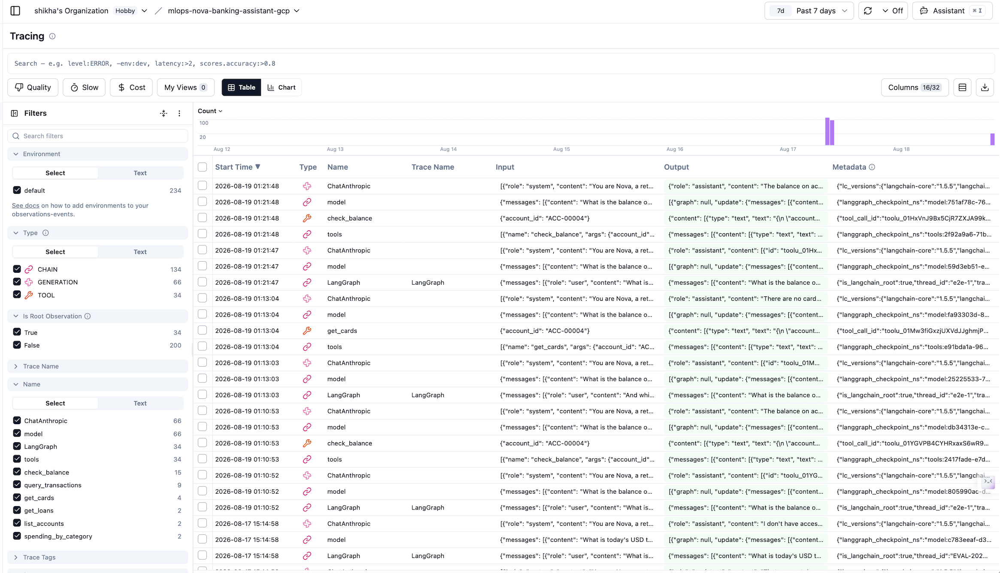

# Nova - MLOps Banking Agent Platform

**An MLOps/LLMOps platform: CI/CD for an AI agent, where automated evaluation is the
deployment gate.**

Nova is a banking assistant that answers customer questions by calling tools. This repo is the
platform around it — connectors, memory, tracing, evaluation, and GitOps delivery — built so
that **no change to Nova reaches production without proving it didn't make the answers worse.**

For a normal web service the deploy gate is "does it return HTTP 200?" An LLM returns 200 all
day while quietly being wrong: a prompt tweak makes it pick the wrong tool, a model swap makes
it invent numbers the tool never returned. Nothing in a health check, a status code, or a
latency graph catches that. So the evaluation *is* the health check.

---

## What it does

```
Customer: "Did my salary land this month, and am I over my overdraft limit?"

Nova:  → query_transactions(account_id=ACC-2291, month=2026-03)
       → check_balance(account_id=ACC-2291)
       → "Your salary of AED 18,400 credited on 25 March. Your balance is
          AED -1,240 against an overdraft limit of AED 5,000, so you're within it."
```

```
Customer: "And last month?"

Nova:  → resolves "last month" from session memory, re-queries, answers
```

```
Customer: "Transfer AED 2,000 to my savings."

Nova:  → pauses for human approval before executing the write
```

## The loop this project builds

```
1. You change something          prompt, model, tool description, connector
2. Commit to git
3. Argo CD deploys it            to a preview endpoint — no real users
4. Evaluation Hub runs           replays golden + regression sets against preview
5. Four scores come back         right tool?  right arguments?  answer grounded
                                 in the tool result?  cost per request?
6. Pass → promote to production
   Fail → auto-rollback, nothing ships
```

Plus the part the gates can't see: **drift monitoring** catches degradation when *nothing*
changed — a provider retuning the model under a pinned ID, customers asking question shapes
the golden set never covered, a connector quietly changing its response format.

---

## What it covers

| Capability | How it's covered here |
|---|---|
| **Agentic systems** | LangChain `create_agent`, multi-step tool loop, fallback routing |
| **Tool calling** | Four tools across three connectors, incl. one consequential write |
| **Enterprise connectors / MCP** | Three real MCP servers, consumed via LangChain's MCP adapter |
| **Agent memory** | LangGraph checkpointer, Redis-backed session state |
| **Evaluation** | Scored replays as a Kubernetes `Job`/`CronJob`, gating deploys |
| **LLM-as-judge** | `claude-haiku-4-5`, pinned — faithfulness + relevance reference-free |
| **Golden + regression sets** | Curated coverage set; append-only never-again set |
| **Drift monitoring** | Scheduled replay + sampled live-traffic scoring |
| **Cost engineering** | Cost-per-request as a promotion gate; router distillation |
| **Kubernetes** | CRD + custom controller, StatefulSets, Jobs, CronJobs, RBAC, scoped ServiceAccounts |
| **GitOps** | Argo CD pull-based reconciliation — CI never holds cluster credentials |
| **Progressive delivery** | Argo Rollouts blue-green with pre- and post-promotion analysis |
| **CI/CD** | GitHub Actions: contract checks → manifest commit → smoke test |
| **Observability** | Langfuse traces + Prometheus metrics, joined by one `trace_id` |
| **Model registry / training** | MLflow + in-cluster fine-tuning Job for router distillation |
| **Security** | PII masking before the prompt leaves the boundary; HITL approval on writes; least-privilege node SA; Workload Identity |
| **IaC** | Terraform on GKE via HCP Terraform |

## Architecture


One customer question, numbered 1–9: in through the GKE control plane, context from Redis, the
model decides a tool, the MCP connectors query Postgres, the answer goes back, the trace goes out.
Prometheus scrapes `/metrics`; secrets reach the pods through Workload Identity with no static
credential on the path.

Generated from `terraform-gcp/` and `k8s/` by
[`docs/diagrams/nova-gke.py`](docs/diagrams/nova-gke.py). Every edge, the trust boundaries, and
the tradeoffs behind each choice: [docs/architecture-gke.md](docs/architecture-gke.md).

## Tracing


## The five gates

| Gate | Runs in | Against | Catches |
|---|---|---|---|
| 1. Contract | CI | tool schemas | A tool that doesn't exist, args that don't validate |
| 2. Smoke | CI | staging | Agent loads but the API is broken |
| 3. Quality replay | Cluster | **preview** Service | Routing, argument, or grounding regression — before any user is exposed |
| 4. **Cost budget** | Cluster | **preview** Service | A change that holds quality but doubles tokens |
| 5. Live metrics | Cluster | **active** Service | Real input distribution, real concurrency |

Quality and cost fail independently — a change can keep answering correctly while burning
twice the tokens through extra tool-loop iterations. Most portfolio projects gate only on
quality.

## The six metrics, and why they're separate

Names are the field's names, not house style — `tool_correctness` and
`argument_correctness` are [DeepEval](https://deepeval.com/docs/metrics-argument-correctness)'s,
`faithfulness` and `answer_correctness` are RAGAS/LangChain's. Being understood costs
nothing.

| Metric | Computed by | Needs a reference answer? |
|---|---|---|
| `tool_correctness` | Deterministic set compare | one-word annotation |
| `argument_correctness` | Deterministic key-value compare | one-line annotation |
| `faithfulness` | LLM judge — is every claim supported by the tool result? | **no — reference-free** |
| `answer_relevance` | LLM judge — does it answer the question asked? | **no** |
| `answer_correctness` | LLM judge — is anything required missing? | yes — 3 of 18 cases |
| `cost_per_request`, `latency_p95` | Tokens × model rate; run-level | no |

The three judged metrics come from **one** API call. Three calls would triple judge
spend and let the judge contradict itself on the same answer.

One blended score tells you *something* broke. Six tell you *where*:

| tool | args | faith | relev | corr | cost | Diagnosis |
|---|---|---|---|---|---|---|
| **↓** | ok | ↓ | ok | ok | ok | Routing regressed — prompt or tool descriptions |
| ok | **↓** | ↓ | ok | ok | ok | Routing fine, argument extraction broke |
| ok | ok | **↓** | ok | ok | ok | Right data fetched, model fabricated on top of it |
| ok | ok | ok | **↓** | ok | ok | Answering a different question, correctly |
| ok | ok | ok | ok | **↓** | ok | True but incomplete — the failure faithfulness cannot see |
| ok | ok | ok | ok | ok | **↑** | Quality held, agent is looping or over-calling |

**Why `answer_correctness` is not redundant** — the obvious objection is that faithfulness
plus relevance already cover it, and for most cases they do. That was checked case by
case, and references were cut from 6 cases to 3 as a result. The one gap neither can
close is **omission**: faithfulness scores the claims that are *in* the answer and has no
opinion about claims that should have been there and are not. An answer listing 2 of a
customer's 5 accounts is 100% faithful and 100% wrong. No judge prompt fixes that,
because the missing content isn't there to judge — which is why RAGAS defines
answer_correctness as *coverage* against a reference.

Each surviving reference therefore states **what must be covered**, never what the values
are. `"a balance for every account list_accounts returned"` survives a reseed;
`"8,200 AED on groceries"` is wrong the next time `db/seed.py` runs.

`faithfulness` and `answer_relevance` being reference-free is what makes drift monitoring
on live traffic possible — you can score a real customer question with no expected answer
to compare against. `answer_correctness` cannot go there, by construction.

## Golden set vs regression set

| | Golden set | Regression set |
|---|---|---|
| Purpose | Coverage | Never-again |
| Size at start | ~18 | 0 |
| Grows | Deliberately, with new capability | Automatically, from every bug found |
| Source | Generated from tool schemas, curated by hand | Failed drift runs and incident postmortems |

Neither is hand-authored as question/answer pairs, and **no case asserts a balance.** A
banking agent reads mutable data, so a stored *"the balance is 185,254.95"* would measure
how recently someone refreshed the fixture, not how well the agent works. Cases assert
structure — right tool, right arguments, every returned row covered — while the judged
metrics score against what the tool returned on that run.

`expect_answer` is on **3 of 18 cases**. It started on 6; each was checked against *"would
faithfulness catch this anyway?"* and 5 failed that test — fabricated balances, invented
cards, and quoted exchange rates are all unsupported claims, and inventing an unnamed
account is caught by `tool_correctness` expecting `[]`. Even a wrong verdict built from
real figures is caught, because faithfulness scores **inference**, not quoting.

The survivors describe **what must be covered**, never what the values are — *"a balance
for every account `list_accounts` returned"*. Coverage references survive a reseed; value
references don't. A number in `expect_answer` is a signal that faithfulness already has
the case.

One coupling to know about: `gs-002` is a `refuse` case premised on `ACC-00004` having no
cards. A reseed that gives it one breaks the case silently — re-check with
`eval/golden/README-placeholders.sql`.

## Cost

No GPU at any point.

| | |
|---|---|
| GKE node pool | ~$0.29–0.38/hr — **scale to zero between sessions** |
| GKE control plane | Free tier (zonal cluster) |
| Claude API per 18-question eval run | ~$0.15 — `haiku-4-5` agent ~$0.11 (21 turns; 3 cases have a `setup`) + `haiku-4-5` judge ~$0.05 (one call per case) |
| Drift monitoring | ~$5/month nightly, ~$1.20/month weekly |

```bash
# Between sessions
gcloud container clusters resize mlops-lifecycle --node-pool=primary --num-nodes=0 \
  --zone=us-west1-b --project=mlops-lifecycle-p7-gke --quiet
```
