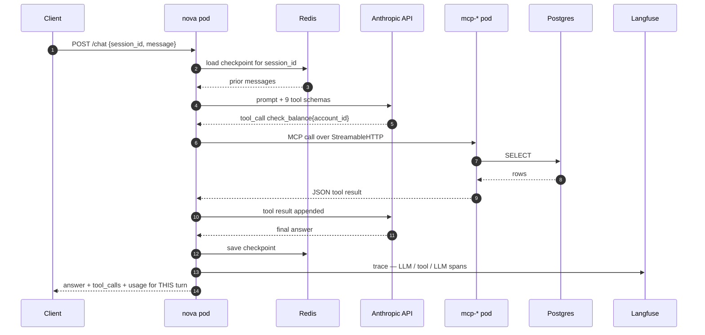

# Nova on GKE — architecture

What is **actually deployed**, as of **2026-08-17** (Phases 0–2 complete). Nothing on this page
is aspirational: if it's drawn, it's running in the cluster.

- GCP project `mlops-lifecycle-p7-gke` · region `us-west1` · zone `us-west1-b`
- GKE **zonal** cluster `mlops-lifecycle`, VPC-native, private nodes, **no GPU**
- Node pool `primary` — 2 × `e2-standard-4`, **scaled to 0 between sessions**
- Everything application-side lives in one namespace, `nova`

Diagrams are generated from source, not hand-drawn — the script in `docs/diagrams/` is the
source of truth and is read off `terraform-gcp/*.tf` and `k8s/*.yaml`:

```bash
brew install graphviz            # once — provides the `dot` engine
pip3 install diagrams            # once — mingrammer/diagrams, official GCP + k8s icons
python3 docs/diagrams/nova-gke.py
```

---

## 1. The system


Source: [`diagrams/nova-gke.py`](diagrams/nova-gke.py)

A **runtime** diagram: it follows one customer question through the system, numbered 1–9.
Provisioning and build-time components — Terraform, Cloud Build, Artifact Registry, the seed
Job, the eval runner — are deliberately absent, because they create the system rather than take
part in an interaction. Dotted edges are standing background: credentials the pods already hold,
refreshed hourly, not fetched per request.

Laid out as **trust zones** — internet, public edge, your private VPC, Google-managed APIs —
rather than the public/private subnet lanes an AWS diagram would use. GCP has no such subnet
concept; §2 is why, and it is worth being able to say out loud.

Four things to take away:

- **Nova is ClusterIP only.** No Ingress, no LoadBalancer — so step 2 is real: with no front
  door, a request reaches the pod through a `kubectl port-forward` tunnel via the API server.
- **Cloud NAT is the only egress path**, because private nodes have no external IP. Anthropic and
  Langfuse leave through it; Secret Manager does *not* — that's Private Google Access. Two
  different paths that fail with the same symptom, a hang, for different destinations.
- **No static credential exists on the secrets path.** ESO's Kubernetes SA is annotated to a GCP
  service account and the metadata server issues short-lived tokens. `secretAccessor` is granted
  **per secret**, not project-wide.
- **Langfuse is dashed on purpose.** Its Secret refs are `optional: true`, so missing keys start
  Nova **untraced** rather than stuck in `CreateContainerConfigError`. Tracing must not be able to
  take down the thing it traces.

---

## 2. "Where are the public and private subnets?"

The first thing an AWS-shaped eye looks for, and it is genuinely absent. GCP does not model
public vs private at the subnet level, so the diagram uses **trust zones** instead — which is
what the AWS subnet split is really communicating.

| AWS mental model | GCP reality | Consequence for the diagram |
|---|---|---|
| Subnet is public or private, decided by its **route table** — IGW route or not | A GCP subnet has **no public/private flag**. Every VPC carries an implicit `0.0.0.0/0 → default-internet-gateway` route on every subnet | There are no lanes to draw |
| Privacy comes from which subnet you land in | Privacy comes from the instance having **no external IP** (`enable_private_nodes = true`) plus firewall rules. Two nodes in one subnet can differ | "Private" is a property of the node pool, so it's labelled there |
| NAT Gateway is an appliance placed **in a public subnet**, per AZ | Cloud NAT is a **regional, software-defined** service on a Cloud Router. It occupies no subnet and has no instance | Drawn at the public edge, not inside the VPC box |
| Subnets are **AZ-scoped** → diagrams get AZ columns | Subnets are **regional**. This is a zonal cluster, so nodes sit in `us-west1-b`, but the subnet spans `us-west1` | No AZ columns; the zone is on the node pool label |
| Security groups attach to instances | Firewall rules are **VPC-level**, targeted by network **tag** or **service account**. No NACL equivalent — rule priority does that job | The IAP-SSH rule targets a tag, not a box |
| ALB in the public subnet, targets private | This cluster has **no Ingress and no LoadBalancer** | The public-edge zone is deliberately near-empty |

**So what is actually public here?** Exactly two things:

1. The **GKE control-plane endpoint** — public, but `master_authorized_networks` narrows it to a
   single /32. It also lives in a Google-managed VPC (`172.16.0.0/28`) peered to yours, not in
   your subnet at all.
2. **Cloud NAT's auto-allocated egress IPs** — outbound only. Nothing can dial in through them.

There is no inbound public data path. Nova is ClusterIP; the front door is `kubectl
port-forward`. If this ever needs a real one, the GCP shape is a GKE Ingress or Gateway
provisioning a Google Cloud Load Balancer that targets **pod IPs directly through NEGs** —
container-native load balancing, which is what VPC-native mode buys and what skips the
`nodeport → kube-proxy → other-node` double hop.

## 3. One question, end to end

Kept as a sequence diagram — graphviz draws topology well and message ordering badly.



Two things this is meant to make obvious:

- **The loop can repeat.** `NOVA_RECURSION_LIMIT=15` ≈ 7 tool rounds. That cap is the per-request
  cost ceiling, not a correctness setting.
- **Only the current turn is reported.** `result["messages"]` is the whole thread; slicing per
  turn is what lets a cost gate tell a wasteful agent from a long conversation.

---

## 4. Every connection, and why

| From | To | How | Why it's shaped this way |
|---|---|---|---|
| Laptop | Control plane | HTTPS :443 | Endpoint is public but `master_authorized_networks` is one /32. No bastion, no 0.0.0.0/0. That IP is residential and rotates — a `kubectl` hang with no clear error is this. |
| Nodes | Artifact Registry | Private Google Access | Private nodes have no external IP; Google APIs traverse Google's network, not the NAT. |
| Nodes | Docker Hub, PyPI, Anthropic, Langfuse | Cloud NAT | The only route to the public internet. |
| ESO pod | Secret Manager | Workload Identity | KSA → GSA, short-lived tokens. No JSON key exists to leak or rotate. |
| ESO | K8s Secrets | ExternalSecret, 1h refresh | The *reference* is in git, the value never is. Rotation still needs a rollout — Postgres reads its password once at startup. |
| Nova | mcp-* | MCP StreamableHTTP :8080 | Three Deployments off one image, different entrypoints. Separate connectors = separate blast radius and separate tool schemas. |
| mcp-* | Postgres | SQL :5432, headless svc DNS | Connectors own data access; Nova never speaks SQL. |
| Nova | Redis | LangGraph checkpointer :6379 | `redis-stack-server`, not `redis:7-alpine` — the checkpointer needs RediSearch. Plain Redis makes session memory die silently. |
| Nova | Anthropic | HTTPS via NAT | The only inference dependency. No GPU by design. |
| Cloud Build | Artifact Registry | `docker push :TAG` | Native amd64 build; no local daemon needed. |

---

## 5. Deliberate choices worth defending

| Choice | Instead of | Why here | What it costs |
|---|---|---|---|
| Zonal cluster | Regional | One control plane; the shape the GKE free tier covers | No zone-failure survival |
| In-cluster Postgres StatefulSet | Cloud SQL | Cheaper, and a real StatefulSet to operate | Manual backups, no IAM DB auth |
| In-cluster Redis, 1 replica | Memorystore / Sentinel | Cost | No HA; a restart replays AOF, it does not fail over |
| Private nodes + restricted public endpoint | Private endpoint + bastion | `kubectl` works with no tunnel | CIS GKE Benchmark wants the private endpoint |
| Dedicated node SA | Compute Engine default SA | The default holds project **Editor**, inherited by any pod that reaches the metadata server | One more Terraform resource |
| `random_password` → Secret Manager | Value injected out-of-band | `terraform apply` alone leaves a working system | Plaintext in HCP state, twice |
| ClusterIP everywhere, no Ingress | LoadBalancer / Ingress | Nothing needs to be internet-facing | No public demo URL |
| Commit-derived image tags | `:latest` | "Which build is live" stays answerable | A `sed` step at apply time |

---

## 6. Not drawn, because it does not exist yet

Named rather than diagrammed, so the diagrams can't overstate the system. Phase ordering and
rationale live in the local `status.md` (gitignored — not in the public repo).

| Missing | Phase | What stands in today |
|---|---|---|
| Prometheus / Grafana | 3 | Langfuse traces only; no metrics, no dashboards |
| PII masking, human approval middleware | 2.5 | `initiate_transfer` exists as a tool with no approval gate |
| Evaluation Hub — `EvaluationRun` CRD, kopf controller, runner Job, drift CronJob | 4 / 4.5 | `eval/run_eval.py` run by hand from the laptop |
| GitHub Actions gates, Argo CD, Argo Rollouts blue-green | E1 | `sed IMAGE_TAG … \| kubectl apply -f -` |
| MLflow registry, cheap-router training Job | E3 | nothing — no model is trained in this project yet |

Until E1 lands the evaluation produces a verdict that **nothing consumes**. That gap is the point
of the remaining build, not an oversight.

---

## 7. Cost and teardown

Node pool ~$0.29–0.38/hr · Cloud NAT ~$0.05/hr · PVCs and Artifact Registry in cents. Between
sessions the pool goes to zero rather than the cluster being destroyed:

```bash
gcloud container clusters resize mlops-lifecycle --node-pool=primary --num-nodes=0 \
  --zone=us-west1-b --project=mlops-lifecycle-p7-gke --quiet
```

Teardown of last resort, which also removes the NAT:
`gcloud projects delete mlops-lifecycle-p7-gke`.
