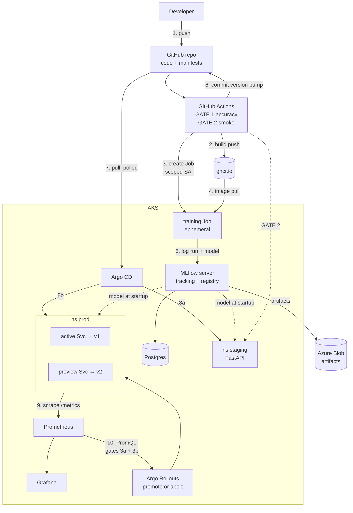

# P7 Architecture — what connects to what

## At a glance

The whole planned system, six blocks:

```
   ┌──────────┐      ┌──────────────────┐      ┌──────────┐
   │  GitHub  │─────►│  GitHub Actions  │─────►│ ghcr.io  │
   │  repo    │      │  gates 1 and 2   │      │  images  │
   └────▲─────┘      └────────┬─────────┘      └────┬─────┘
        │ commit bump         │ create Job          │ image pull
        │                     │                     │
        │ pull (GitOps)       │                     │
   ═════╪═════════════════════╪═════════════════════╪═══════ AKS ══════
        │                     ▼                     ▼
   ┌────┴─────┐        ┌──────────────┐      ┌──────────────────────┐
   │ Argo CD  │        │ training Job │      │  MLflow + Postgres   │
   └────┬─────┘        └──────┬───────┘      │  tracking + registry │
        │                     └─────────────►└──────────┬───────────┘
        │ apply                  log run                │ artifacts
        ▼                                               ▼
   ┌─────────────────────────────────┐        ┌──────────────────────┐
   │  ns staging  ──►  ns prod       │        │  Azure Blob          │
   │                 (blue-green)   │        └──────────────────────┘
   └────────────────┬────────────────┘
                    │ scrape
                    ▼
   ┌─────────────────────────────────┐
   │ Prometheus ──► Argo Rollouts    │  gates 3a and 3b
   │      └──────► Grafana           │  promote or abort
   └─────────────────────────────────┘
```

Read it as two loops:-
**CI loop:** push → build → train → register → commit.
**Cluster loop:**
Argo CD pulls → deploys → Prometheus measures → Rollouts decides. The two only meet at the git
repo, which is the point.

---

Below: the same picture in detail. The **plain-text version** works anywhere, including a terminal
or a whiteboard. The **rendered version** is the same graph in mermaid, for GitHub.

---

## The detailed version

```
   OUTSIDE THE CLUSTER
   ─────────────────────────────────────────────────────────────────────────

        ┌──────────────────┐                      ┌──────────────────┐
        │   GitHub repo    │  (2) build & push    │     ghcr.io      │
        │ code + manifests │─────────────────────►│  container imgs  │
        └────┬────────▲────┘                      └────────┬─────────┘
       (1)   │        │  (6) commit version bump            │
      push   │        │                                     │
             ▼        │                                     │
        ┌─────────────┴────┐                                │
        │  GitHub Actions  │   GATE 1: accuracy             │
        │                  │   GATE 2: smoke test           │
        └────┬────────┬────┘                                │
             │        │                                     │
             │        │ (3) create training Job             │ (4) pull image
             │        │     (scoped ServiceAccount)         │
   ══════════│════════│═════════════════════════════════════│══════════════
   AKS       │        ▼                                     ▼
             │   ┌──────────────────────────────────────────────┐
             │   │  training Job          (ephemeral, 2 vCPU)   │
             │   └───────────────────┬──────────────────────────┘
             │                       │ (5) log params, metrics, model
             │                       ▼
             │   ┌──────────────────────────────┐    ┌──────────────────┐
             │   │  MLflow server               │───►│  Postgres        │
             │   │  tracking + registry         │    │  metadata + PVC  │
             │   │  --serve-artifacts           │    └──────────────────┘
             │   └───────────────┬──────────────┘
             │                   │  artifacts
             │                   ▼  ══════════════ back outside the cluster
             │   ┌──────────────────────────────┐
             │   │  Azure Blob Storage          │  weights, signature, pip env
             │   └──────────────────────────────┘
             │
             │ (7) Argo CD pulls manifests from git
             ▼
        ┌──────────────────┐
        │    Argo CD       │  the only thing that writes to staging + prod
        └────┬────────┬────┘
             │        │
      (8a)   │        │  (8b) sync prod
   sync      ▼        ▼
   staging ┌─────────────────┐   ┌────────────────────────────────────────┐
           │  ns staging     │   │  ns prod                               │
           │                 │   │  ┌──────────────────────────────────┐  │
           │  FastAPI pod    │   │  │ Rollout (blue-green)             │  │
           │  (candidate)    │   │  │                                  │  │
           │                 │   │  │  active  Svc ──► v1 pods (live)  │  │
           │  ▲              │   │  │  preview Svc ──► v2 pods (new)   │  │
           └──┼──────────────┘   │  └──────────────────────────────────┘  │
              │                  └───────────────┬────────────────────────┘
              │ GATE 2 hits this                 │ (9) scrape /metrics
              │                                  ▼
              │                  ┌────────────────────────────────────────┐
              │                  │  Prometheus  ──────►  Grafana          │
              │                  └───────────────┬────────────────────────┘
              │                                  │ (10) gates 3a + 3b query
              │                                  ▼
              │                  ┌────────────────────────────────────────┐
              │                  │  Argo Rollouts controller              │
              │                  │  decides: promote or abort             │
              │                  └────────────────────────────────────────┘
              │
              └── every serving pod also pulls its model from MLflow at startup
```

## Every connection, and why

| # | From | To | How | Why |
|---|---|---|---|---|
| 1 | Developer | GitHub | git push | Code and manifests live together |
| 2 | GitHub Actions | ghcr.io | docker push | Training + serving images. Free for public images, AKS pulls with no auth. |
| 3 | GitHub Actions | AKS | kubectl create job | The **only** cluster access CI has. ServiceAccount scoped to creating Jobs in one namespace. |
| 4 | Pods | ghcr.io | image pull | Training Job and serving pods both |
| 5 | Training Job | MLflow | HTTP (MLflow client) | Params, metrics, the model, git SHA, dataset hash |
| 6 | GitHub Actions | GitHub | git commit | Version bump in the manifest. **This is the deploy** — CI does not apply anything. |
| 7 | Argo CD | GitHub | git pull, polled | Cluster pulls its desired state. Nothing pushes to the cluster. |
| 8 | Argo CD | staging + prod | applies manifests | Argo CD is the only writer to these namespaces |
| 9 | Prometheus | serving pods | scrape `/metrics` | Latency, error rate, confidence — all labelled by `model_version` |
| 10 | Rollouts controller | Prometheus | PromQL | Gates 3a and 3b. This is what decides promote or abort. |
| — | Serving pods | MLflow | HTTP at startup | Loads `models:/banking77-intent@champion`. No storage credential needed. |
| — | MLflow | Postgres | SQL | Run metadata, registry versions, aliases |
| — | MLflow | Azure Blob | HTTPS | The artifacts themselves |

## Four things the diagram is trying to show

**CI holds almost no cluster power.** Arrow 3 is the entire extent of it — create a Job in one
namespace. Deployment happens through arrow 6 (a git commit) and arrow 7 (the cluster pulling).
No kubeconfig, no admin token, no `kubectl apply` from CI. That's the GitOps payoff.

**Only one pod holds a storage credential.** MLflow runs with `--serve-artifacts`, so training Jobs
and serving pods upload and download *through* it. They never see the Blob key.

**Blob and Postgres sit at different levels on purpose.** Postgres is in-cluster because its data
is cheap to rebuild. Blob is outside because the registry's models must survive
`terraform destroy`.

**Nothing is internet-facing.** Argo CD, Grafana and MLflow are all ClusterIP. You reach them with
`kubectl port-forward`. The only inbound path to the cluster is Argo CD polling *outward* to
GitHub.

---

## Zoom in: the blue-green switch

The part worth understanding properly, because it's where the gates live.

```
BEFORE                     GATE 3a (prePromotion)          AFTER (gate 3b passed)

active  Svc ──► v1 ✓live   active  Svc ──► v1 ✓live        active  Svc ──► v2 ✓live
                           preview Svc ──► v2  ← replay                     v1 (kept warm
                                               golden set                    for scaleDown-
                                               here. no                      DelaySeconds)
                                               user traffic
```

1. Argo CD applies the new version. Rollouts brings up **v2 pods behind the preview Service only**.
2. **Gate 3a** replays the golden set against preview. No user is exposed. Fail here and the active
   Service never moves.
3. Pass, and the **active Service selector flips** to v2. Instant, atomic, no pod restarts.
4. **Gate 3b** watches live metrics for a few minutes. Fail and the selector flips back to v1 —
   which is still running.
5. Only after 3b passes do the v1 pods scale down.

**Step 5 is the trap.** `scaleDownDelaySeconds` defaults to 30 seconds. If v1 is gone before gate 3b
finishes, the "instant" rollback has to cold-start pods and load model weights again. Set it to
several minutes and accept paying for double capacity during the window.

## Production deltas

What's a demo shortcut here, and what it becomes at scale. This is the "what would you change?"
question, pre-answered.

| Area | This project | Production | Why it changes |
|---|---|---|---|
| **Backend store** | Postgres pod + PVC | Azure Database for PostgreSQL Flexible Server | Backups, point-in-time restore, patching, HA. Lose this and you lose the registry even though the weights survive in Blob. |
| **Exposure** | `kubectl port-forward` | One ingress controller behind one load balancer | Port-forward is one user, one terminal, and every viewer needs cluster credentials. |
| **Internal tools** | ClusterIP, no auth | Private DNS + SSO (OIDC/SAML), VPN or Private Link | Argo CD can deploy anything to the cluster. It must never be publicly reachable. |
| **Inference endpoint** | ClusterIP | Public ingress with TLS, WAF, rate limiting, authn, quotas | The only thing that should be reachable from outside. |
| **Storage credential** | Account key in a K8s Secret | AKS workload identity + Key Vault | Removes the long-lived key entirely. Pods get short-lived federated tokens. |
| **Images** | ghcr.io, public | Private registry + vulnerability scanning + signing (cosign) + admission policy | You need to know what's running and be able to prove it wasn't tampered with. |
| **Node pools** | 2 fixed `D4s_v3`, one pool | Separate system/user pools, cluster autoscaler, training pool scaling 0→1 per job | Training capacity is bursty. Paying for it 24/7 is waste; GPU nodes make that waste expensive. |
| **MLflow server** | 1 replica | Multiple replicas behind the Service | It's stateless once Postgres and Blob are external, so this is nearly free HA. |
| **Blob** | LRS, key auth, no lifecycle rules | ZRS/GRS, private endpoint, lifecycle tiering, immutability for audited models | Old model versions accumulate forever, and regulated environments need them provably unmodified. |
| **Prometheus** | 6h retention, alertmanager off | Long-term store (Thanos/Mimir/Azure Monitor) + Alertmanager wired to on-call | 6h can't answer "was this model worse last month?" |
| **Training orchestration** | CI creates one Job | Argo Workflows or Kubeflow Pipelines | Real pipelines are DAGs with retries, caching, and fan-out — not one Job. |
| **Gate thresholds** | Constants in the pipeline | Per-model config, versioned as policy | Different models tolerate different risk. A fraud model's gate isn't an intent classifier's gate. |
| **Terraform** | HCP local execution, applied by hand | CI-driven plan + review + apply, with drift detection | Infra changes deserve the same review as model changes. |
| **Model quality** | Confidence proxies only | Labelled feedback loop with delayed ground truth + drift detection | See the lifecycle primer, stage 7 — proxies tell you *something changed*, not *what's wrong*. |
| **DR** | None | Documented RTO/RPO, registry export, multi-region plan | "Can you rebuild the registry?" is a real audit question. |

### The three that matter most

**Managed Postgres.** The registry is the crown jewels. Blob holds the weights, but Postgres holds
the *meaning* — which version is champion, what it scored, where it came from. Losing it turns your
artifact store into a folder of anonymous `.pkl` files. In-cluster with a single PVC and no backup
is the biggest real risk in this design.

**Workload identity instead of a storage key.** The account key in `storage.tf` is the one
long-lived secret in the system. Workload identity replaces it with short-lived federated tokens
tied to a ServiceAccount, so there is nothing to leak or rotate. This is the single highest-value
security upgrade in the list.

**Ingress with SSO for internal tools.** Not because port-forward is insecure — it's actually quite
safe — but because it doesn't scale past one person, and the alternative people reach for
(`type=LoadBalancer` per service) puts unauthenticated admin UIs on public IPs. Argo CD on a public
IP is a cluster takeover.

### What does not change at scale

These are production patterns already, not demo shortcuts:

- **The GitOps model.** CI commits, the cluster pulls.
- **Four gates in two locations.** Correct at any scale. Only the thresholds and the metrics get
  richer.
- **Blob outside the cluster.** Artifacts must outlive the cluster.
- **`--serve-artifacts`.** A single credential holder is the right design regardless of size.

## Rendered version


